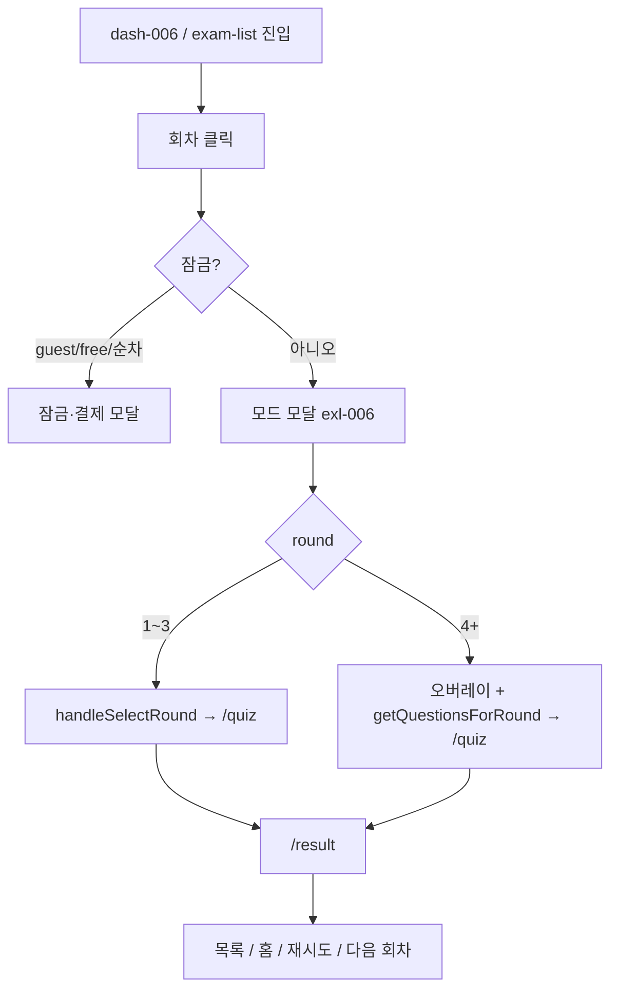

# 유저 플로우 (User Flow)

`IA.md`와 **실제 소스**(`App.tsx`, `useAppNavigation.ts`, `ExamList.tsx`, `examService.ts` 등)를 대조해 정리했습니다.  
플래그(`isBeta`, `useBetaCertifications`, `FEATURE_COUPON`)에 따라 분기는 달라질 수 있습니다.

---

## 코드 대조 요약

| 주제 | 근거 파일·요지 |
|------|----------------|
| 초기 라우트 | `useAppNavigation.ts` — `useState<Route>('/exam-list')` |
| 비로그인 `/` | `App.tsx` `useLayoutEffect` — `route === '/'` 이면 `navigate('/exam-list')` |
| `/quiz` 가드 | `App.tsx` — `selectedRoundId`·`selectedCertId` 없으면 `navigate('/exam-list')` |
| 비로그인 풀이 | `examService.checkExamAccess` — `!user` 이면 항상 `allowed: false` |
| 회차 목록 잠금 | `ExamList.tsx` `getLockState` — 비로그인 전 회차 `guest`, 로그인·비프리미엄 `n>=3` → `free`, 2~3회차 순차 `premium_sequential` |
| 퀴즈 이탈 | `App.tsx` `Quiz` `onExit` — `user ? /mypage : /exam-list` |
| 로그인 성공 분기 | `handleLoginModalAuthSuccess` — intent별 + `onboardingStatus` 0→OT, 1+베타+쿠폰→`fromUpdate`, 그 외 `/mypage` |
| 베타·게스트 이어하기 | `App.tsx` — `isBeta` 일 때 `guestContinue` 리다이렉트 복원 `useEffect`가 **조기 return** (비베타에서만 스토리지 복원) |
| 집중학습 | `pendingFocusTraining` → 모드 모달 → `handleFocusModeSelect` — 과목=`alert` 부족, 유형=`alert` 없음, 개념=`showInsufficientDataModal` |
| 결제 | `navigate('/checkout')` → `setShowCheckoutModal(true)` only (`Route` 아님) |

---

## 1. 진입 · 셸

| 단계 | 행동 | 결과 (코드 기준) | IA ID |
|------|------|------------------|-------|
| 첫 로드 | PC | `route` 기본값 `/exam-list` | §1.1 |
| 첫 로드 | 모바일 | 전역 PC 안내 화면만 | `glo-001` |
| LNB 로고 | 비로그인 | `/exam-list` | `lnb-001` |
| LNB 로고 | 로그인 | `/` | `lnb-001` |
| LNB `/login` | — | 모달만 (`guestQuizLogin`은 현재 경로가 `/quiz`이고 비로그인일 때) | `log-003` |
| 보호 경로 | 비로그인이 `/mypage` 등 시도 | 로그인 모달 + `route`는 `/mypage`면 **`/exam-list`로 덮어씀**, `/account-settings`·`/admin`은 요청 경로로 `route` 유지 | `useAppNavigation` L80-88 |

---

## 2. 비로그인 사용자

**목적**: 목록 탐색 후 로그인으로 이어지기.

1. **`/exam-list`**  
   - `ExamList` `getLockState`: `!user` → **모든 회차 `locked: true`, `reason: 'guest'`**  
   - 클릭 시 `handleRoundClick` → `showLockedModal`, 메시지 “로그인이 필요한 서비스입니다.”, `onRequestLogin` 등으로 **`LoginModal`**

2. **`checkExamAccess`** (`Quiz` 로드 시)  
   - 비로그인이면 **어떤 회차도** 허용 안 됨 → `ErrorView` + “모의고사를 풀려면 구글 로그인이 필요합니다.” → `onBack` 시 목록 등

3. **직접 URL `/quiz`**  
   - cert/round 없으면 `App`이 곧바로 `/exam-list`  
   - 있어도 위 접근 검사에서 차단

**IA**: `exl-002`, `exl-008`, `mod-001`

---

## 3. 로그인 후 온보딩 · OT (베타 중심)

`handleLoginModalAuthSuccess` (`App.tsx`):

| 조건 | 다음 동작 |
|------|-----------|
| `needsVerificationBanner` | 로그인 모달 닫고 `pendingVerificationBanner` (이메일 인증 배너) |
| `intent === 'guestContinue'` + `pendingGuestContinue` | `/quiz` + 21번째부터, `showGuestContinueModal` (단, **AiBT 베타**에서는 구글 리다이렉트 복원 effect가 `guestContinue`를 바로 정리할 수 있음) |
| `intent === 'guestQuizLogin'` | `showQuizLoginSuccessModal` |
| `intent === 'checkout'` | `navigate('/checkout')` → 결제 모달 |
| `onboardingStatus === 0` | `setShowOrientationPopup('forced')` |
| `status === 1` && `isBeta` && (쿠폰/프리미엄) | `setShowOrientationPopup('fromUpdate')` |
| 그 외 (예: status 2) | `setRoute('/mypage')` |

**추가 `useEffect` (베타)**:

- `onboardingStatus === 0` + 베타 + 쿠폰 없음 → `Orientation` forced  
- 로그인 + 베타 + 쿠폰 없음 + status ≠ 0 → forced  
- 베타 + 빅데이터 프리미엄 + 레벨 미선택 → `fromUpdate`  
- `LoginModal`은 **베타·신규(onboarding 0)** 인 동안 자동 닫기에서 **제외** (`user?.onboardingStatus === 0`)

**IA**: `log-*`, `mod-002`, `mod-004`

---

## 4. 대시보드 → 모의고사 본루프

### 4.1 마이페이지에서 목록으로

- **`handleSelectExamFromMyPage`** / **`handleStartDiagnosticTest`**: `setSelectedCertId` 후 **`/exam-list`**  
- 주석: **“학습 시작하기”는 목록만 열고 회차 모달은 자동 오픈하지 않음** (단, `ExamList`의 `initialRoundId` + 로그인 시 재응시 편의로 모달 자동 오픈)

### 4.2 회차 선택 (`ExamList`)

| 상태 | 잠금 규칙 (로그인 사용자) |
|------|---------------------------|
| 만료 구독 (`isExpired`) | 카드는 잠금 UI 아님·클릭 시 **`showStaticModal`** (열람 안내) |
| 비프리미엄 | **1·2회차만** 풀림, **3회차 이상** 잠금 → `showFreePaymentModal` |
| 프리미엄 | 2·3회차는 **이전 회차 완료** 필요 시 `premium_sequential` 잠금 |
| 비로그인 | 전부 `guest` 잠금 |

**모드 모달** (`showModeModal`) 통과 후:

- **round ≤ 3**: `onSelectRound` → 바로 `/quiz`  
- **round ≥ 4** + `user`: 준비 오버레이(카운트다운) + `getQuestionsForRound` → `onSelectAiRound` → `/quiz`  
- **round ≥ 4** + `!user`: 목록 단계에서 이미 잠금 처리(게스트는 회차 클릭이 잠금 모달로 끝남)

### 4.3 풀이 · 결과

- `handleSelectRound` / `handleSelectAiRound`: `navigate('/quiz')`  
- 제출: `handleQuizFinish` → **`/result`**  
- **`Quiz` `onExit`**: 로그인 **`/mypage`**, 비로그인 **`/exam-list`**

### 4.4 결과에서 분기 (`Result` + `App` 모달)

- **홈**: 로그인 **`/`**, 비로그인 **`/exam-list`**  
- **재시도**: `showRetryModeModal` → 모드 선택 → `handleSelectRound` 등으로 **`/quiz`**  
- **다음 회차** (`onNextRoundAuto`): 비로그인 → 목록; 비프리미엄 → `showNextRoundPaymentModal` → 확인 시 **`setShowCheckoutModal(true)`**; 프리미엄 → `showNextRoundModeModal` → 맞춤형이면 `showNextRoundPreparing` + 프리패치 후 **`handleSelectAiRound`** 또는 정적이면 **`handleSelectRound`**

---

## 5. 집중 학습 (과목 / 유형 / 개념)

1. `MyPage*`에서 CTA → `handleStartSubjectStrengthTraining` 등 → **`setPendingFocusTraining`**  
2. **앱 전역 모달** “모의고사 모드 선택” (`App.tsx` ~1611행) — 학습 vs 실전  
3. **`handleFocusModeSelect`**: 최소 **3초** 지연 + fetch  
   - **과목 강화**: 문항 **20개 미만**이면 **`alert`** 후 종료  
   - **취약 유형**: **0개**이면 **`alert`** 후 종료  
   - **취약 개념**: `insufficient` 또는 **50개 미만**이면 **`showInsufficientDataModal`** (다른 두 종류와 다름)  
4. 성공 시 특수 `roundId`(`__subject_strength__` 등) + `preFetchedQuestions` + **`/quiz`**

---

## 6. 계정 · 결제 · 인증

| 플로우 | 코드 요약 |
|--------|-----------|
| 계정설정 | `/account-settings` — `AccountSettings`, 뒤로 `/mypage` |
| 결제 | `showCheckoutModal` + `Checkout`; 완료 시 `handleCheckoutComplete` 등 |
| 로그인 + 미인증 | `main` 상단 배너 + `showResendVerificationModal` |
| 비로그인 인증 대기 | `isLanding` 분기 `pendingVerificationBanner` (레이아웃 상단) |

---

## 7. 관리자

- `canShowAdmin` 일 때 LNB에 `/admin`, `/admin/certs`, `/admin/questions`, `/admin/billing`  
- **`/`** 에서 관리자: `Admin` `initialMenu="dashboard"`  
- **`/admin`** 직접: `initialMenu="users"`  
- 비관리자: `Access Denied` 텍스트

---

## 8. IA 기능 ID 색인

| 여정 | ID |
|------|-----|
| 셸·LNB | `glo-*`, `lnb-*` |
| 전역 모달 | `mod-*` |
| 로그인 가상 경로 | `log-*` |
| 결제 모달 | `chk-*` |
| 대시보드 | `dash-*`, `home-*`, `mypage-*` |
| 회차 목록 | `exl-*` |
| 퀴즈 | `qiz-*` |
| 결과 | `rst-*` |
| 계정 | `acc-*` |
| 관리자 | `adm-*`, `adc-*`, `adq-*`, `adb-*` |

---

## 9. 유지보수

- 잠금·푸시 정책: **`ExamList.getLockState`** 와 **`examService.checkExamAccess`**를 함께 확인할 것 (목록은 열려 있어도 퀴즈 단계에서 거절될 수 있음).  
- 베타 전용 플로우: `App.tsx` 내 `isBeta` 분기 다수.

*작성: `IA.md` + 위 근거 파일 스냅샷 대조.*
